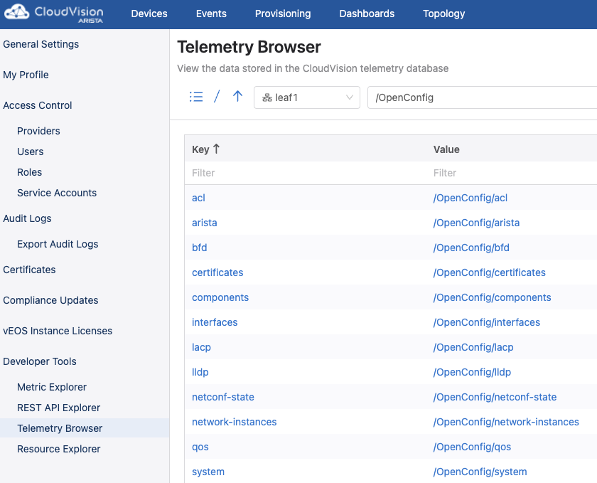

**Table of Contents**

- [About OpenConfig](#about-openconfig)
- [OpenConfig support on EOS](#openconfig-support-on-eos)
- [Configure the devices to stream OpenConfig data to CVP](#configure-the-devices-to-stream-openconfig-data-to-cvp)
  - [Requirements](#requirements)
    - [Certificate-Based TerminAttr Authentication](#certificate-based-terminattr-authentication)
  - [Enable gNMI on EOS Devices](#enable-gnmi-on-eos-devices)
    - [Configure gNMI](#configure-gnmi)
    - [Verify gNMI Status](#verify-gnmi-status)
  - [Configure TerminAttr to publish the OpenConfig data to CVP](#configure-terminattr-to-publish-the-openconfig-data-to-cvp)
  - [Verify the devices are streaming OpenConfig Data to CVP](#verify-the-devices-are-streaming-openconfig-data-to-cvp)

# About OpenConfig

OpenConfig is a working group of technical contributors from different companies (mainly Google).

This working group defines vendor-neutral data models.

The OpenConfig defined YANG modules are published on this Github repository https://github.com/openconfig/public/tree/master/release/models

# OpenConfig support on EOS

Here's the OpenConfig support on EOS

- https://www.arista.com/en/support/toi/path-support
- https://github.com/aristanetworks/yang
  
# Configure the devices to stream OpenConfig data to CVP

## Requirements

### Certificate-Based TerminAttr Authentication

Certificate-based authentication is required for the devices to stream OpenConfig to CVP.  
To enable certificate-based authentication between CVP and the devices, refer to [this directory](../../certificate_based_authentication)

## Enable gNMI on EOS Devices

To stream OpenConfig data to CVP, gNMI needs to be enabled on the EOS devices.

In the example below, `default` is the name of the management VRF. If you use another VRF for management change it accordingly.

### Configure gNMI

```cli
configure
management api gnmi
transport grpc default
exit
```

### Verify gNMI Status

The gNMI server should now be enabled and running on port 6030 in the default VRF.

```cli
show management api gnmi
```

## Configure TerminAttr to publish the OpenConfig data to CVP

The switch will use TerminAttr to publish the OpenConfig data to CVP when the `cvgnmi` flag is set.

```cli
configure
daemon TerminAttr
show active 
```

Add the flag `-cvgnmi` at the end of the daemon TerminAttr configuration, then do a `shutdown`/`no shutdown` on the TerminAttr daemon otherwise the change will not be taken into account and then exit the daemon TerminAttr configuration.

```cli
shutdown
no shutdown
exit
```

## Verify the devices are streaming OpenConfig Data to CVP

The device should now stream OpenConfig data to CVP.

Use the telemetry browser on CVP GUI (**Settings and Tools** > **Developper Tools** > **Telemetry Browser**) to verify it.



Once we configured the devices to stream OpenConfig data to CVP, we can use [gNMI](../gNMI) or [RESTCONF](../RESTCONF)  to access to these data on CVP.
