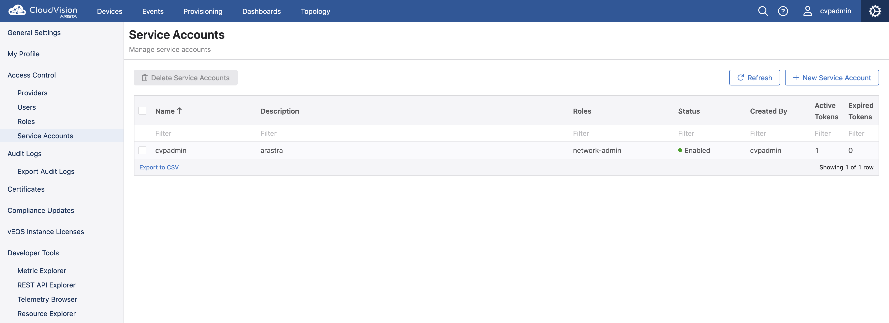
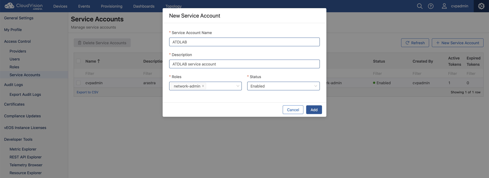
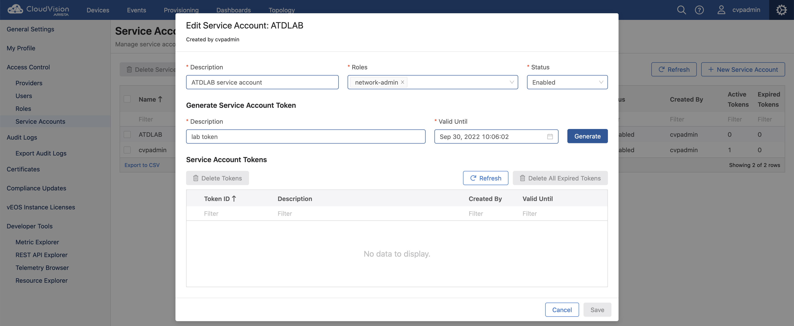

**Table of Content**

- [Create a token using CVP GUI](#create-a-token-using-cvp-gui)
  - [Create a service account](#create-a-service-account)
  - [Create a token](#create-a-token)
  - [Copy the Token](#copy-the-token)
  - [Paste the Token](#paste-the-token)

## Create a token using CVP GUI

This section describes how to generate a token using the CVP GUI.  

### Create a service account

This step is required before to generate a token.

- Connect to the CVP GUI
- Go to the **CVP Setting > Access Control > Service Accounts**
- Click on **+ New Service Account**

- Fill out the requested info
- Select **network-admin** role
- Click on **Add**

### Create a token

- Click on the new Service Account

- Add a description
- Add the expiration date of the token
- Click on "Generate"

### Copy the Token

- Copy the token
- Click on "OK"

### Paste the Token

- Create a new file named `token.tok` on your automation setup
- Copy the generated token to the file
