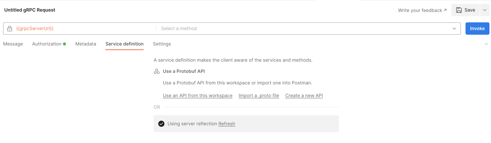
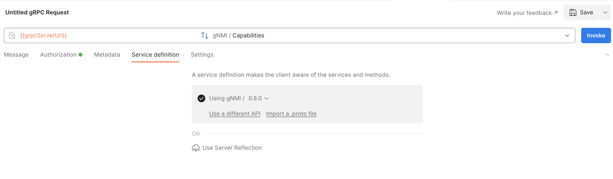
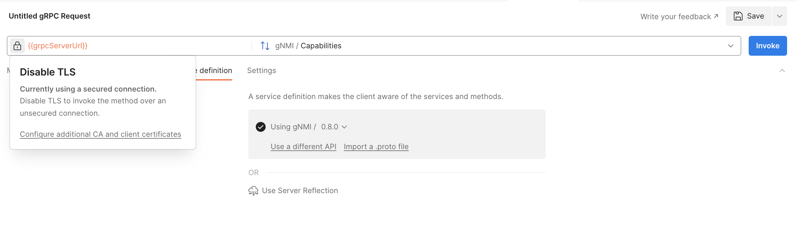

**Table of Contents**

- [Postman and gRPC](#postman-and-grpc)
- [Requirement](#requirement)
- [Clone the gnmi repo on your automation setup](#clone-the-gnmi-repo-on-your-automation-setup)
- [Install Postman Desktop Agent on your automation setup](#install-postman-desktop-agent-on-your-automation-setup)
- [Create a new workspace or select an existing one](#create-a-new-workspace-or-select-an-existing-one)
- [Create and activate a new environment](#create-and-activate-a-new-environment)
- [Create a new request (Capablities)](#create-a-new-request-capablities)
- [Verify the new API](#verify-the-new-api)
- [Add another request to the new collection (Subscribe)](#add-another-request-to-the-new-collection-subscribe)

# Postman and gRPC

We can use Postman to interact with CVP using gRPC (gNMI, resource APIs).  
The gRPC port is 443 and gPRC uses HTTP2.  

# Requirement

Token based authentication is required. To enable token based authentication, refer to [this directory](../Token%20based%20authentication)

# Clone the gnmi repo on your automation setup

The gNMI proto file is https://github.com/openconfig/gnmi/blob/master/proto/gnmi/gnmi.proto

```bash
cd $HOME  
mkdir -p github.com/openconfig
git clone https://github.com/openconfig/gnmi.git github.com/openconfig/gnmi  
ls github.com/openconfig/gnmi
```

# Install Postman Desktop Agent on your automation setup

Importing a proto file and invoking gRPC services is a new Postman feature.  
To connect with a gRPC server (CVP) requires using Postman Desktop Agent (this is not supported with Postman web).  
In this example we are using Postman Desktop Agent Version 9.26.8.

# Create a new workspace or select an existing one

# Create and activate a new environment

From your workspace, you will need to create and activate a new environment  

Click on **Environment** and create a new environment.  
Provide a name to the new environment.
Define these two variables:

- grpcServerUrl: use the CloudVision IP address
- token: use the token generated previously


Activate the environment.  


# Create a new request (Capablities)

From your workspace, select **New > gRPC Request**


Use the variable `grpcServerUrl` for the server URL  
Select the authorization type `Bearer token`  and use the variable `token` for the token  


Click on `Import a .proto file` in service definition


Select the .proto file from the repo you cloned, and define the import path to use if your .proto file import other.proto files.


Click on `Next` and import your .proto file as an API to reuse it in other requests with Postman


Select the RPC `Capabilities` from the `gNMI` service


Enable TLS


Click on Invoke.  
You should get a response.  


Save the new request (name it `Capabilities`) to a new collection (name it `gNMI`)


# Verify the new API

From your workspace, verify the new API.


# Add another request to the new collection (Subscribe)

Duplicate the previous request (`Capabilities`).  
Rename it to `Subscribe to interfaces state`.  
Select the RPC `Subcribe` of the `gNMI` service.  
Copy this in the message (update the `target` with the SN of your device):

```json
{
    "subscribe": {
        "encoding": "JSON",
        "mode": "STREAM",
        "prefix": {
            "target": "BAD032986065E8DC14CBB6472EC314A6"
        },
        "subscription": [
            {
                "path": {
                    "elem": [
                        {
                            "name": "interfaces"
                        },
                        {
                            "name": "interface"
                        },
                        {
                            "name": "state"
                        }
                       ],
                    "origin": "openconfig"
                }
            }
        ]
    }
}
```

Click on `Invoke`


Click on `Send`


Save this request.  